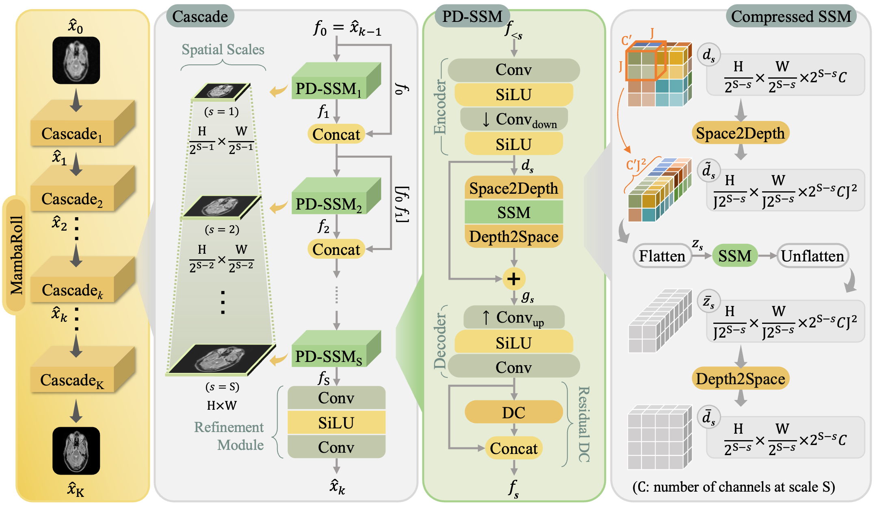

<hr>
<h1 align="center">
  MambaRoll <br>
  <sub>Physics-Driven Autoregressive State Space Models for Medical Image Reconstruction</sub>
</h1>

<div align="center">
  <a href="https://bilalkabas.github.io/" target="_blank">Bilal&nbsp;Kabas</a><sup>1,2</sup> &ensp; <b>&middot;</b> &ensp;
  <a href="https://github.com/fuat-arslan" target="_blank">Fuat&nbsp;Arslan</a><sup>1,2</sup> &ensp; <b>&middot;</b> &ensp;
  <a href="https://github.com/Valiyeh" target="_blank">Valiyeh&nbsp;A. Nezhad</a><sup>1,2</sup> &ensp; <b>&middot;</b> &ensp;
  <a href="https://scholar.google.com/citations?hl=en&user=_SujLxcAAAAJ" target="_blank">Saban&nbsp;Ozturk</a><sup>1,2</sup> &ensp; <b>&middot;</b> &ensp;
  <a href="https://kilyos.ee.bilkent.edu.tr/~saritas/" target="_blank">Emine U.&nbsp;Saritas</a><sup>1,2</sup> &ensp; <b>&middot;</b> &ensp;
  <a href="https://kilyos.ee.bilkent.edu.tr/~cukur/" target="_blank">Tolga&nbsp;Çukur</a><sup>1,2</sup> &ensp;
  
  <span></span>
  
  <sup>1</sup>Bilkent University &emsp; <sup>2</sup>UMRAM <br>
</div>
<hr>

<h3 align="center">[<a href="https://arxiv.org/abs/2412.09331">arXiv</a>]</h3>

Official PyTorch implementation of **MambaRoll**, a novel physics-driven autoregressive state space model for enhanced fidelity in medical image reconstruction. In each cascade of an unrolled architecture, MambaRoll employs an autoregressive framework based on physics-driven state space modules (PSSM), where PSSMs efficiently aggregate contextual features at a given spatial scale while maintaining fidelity to acquired data, and autoregressive prediction of next-scale feature maps from earlier spatial scales enhance capture of multi-scale contextual features

<p align="center">
  
</p>

## ⚙️ Installation

This repository has been developed and tested with `CUDA 12.2` and `Python 3.12`. Below commands create a conda environment with required packages. Make sure conda is installed.

```
conda env create --file requirements.yaml
conda activate mambaroll
```

<details>
<summary>[Optional] Setting Up Faster and Memory-efficient Radon Transform</summary><br>

We use a faster (over 100x) and memory-efficient (~4.5x) implementation of Radon transform ([torch-radon](https://github.com/matteo-ronchetti/torch-radon)). To install, run commands below within `mambaroll` conda environment.

```
git clone https://github.com/matteo-ronchetti/torch-radon.git
cd torch-radon
python setup.py install
```

</details>

## 🗂️ Prepare dataset

MambaRoll supports reconstructions for MRI and CT modalities. Therefore, we have two dataset classes: (1) `MRIDataset` and (2) `CTDataset` in `datasets.py`.

### 1. MRI dataset folder structure

MRI dataset has subfolders for each undersampling rate, e.g. us4x, us8x, etc. There is a separate `.npz` file for each contrast.

<details>
<summary>Details for npz files</summary><br>
  
A `<contrast>.npz` file has the following keys:

| Variable key    | Description                               | Shape                                     | 
|-----------------|-------------------------------------------|-------------------------------------------|
| `image_fs`      | Coil-combined fully-sampled MR image.     | n_slices x 1 x height x width             |
| `image_us`      | Multi-coil undersampled MR image.         | n_slices x n_coils x height x width       |
| `us_masks`      | K-space undersampling masks.              | n_slices x 1 x height x width             |
| `coilmaps`      | Coil sensitivity maps.                    | n_slices x n_coils x height x width       |
| `subject_ids`   | Corresponding subject ID for each slice.  | n_slices                                  |
| `us_factor`     | Undersampling factor.                     | (Single integer value)                    |

</details>

```
fastMRI/
├── us4x/
│   ├── train/
│   │   ├── T1.npz
│   │   ├── T2.npz
│   │   └── FLAIR.npz
│   ├── test/
│   │   ├── T1.npz
│   │   ├── T2.npz
│   │   └── FLAIR.npz
│   └── val/
│       ├── T1.npz
│       ├── T2.npz
│       └── FLAIR.npz
├── us8x/
│   ├── train/...
│   ├── test/...
│   └── val/...
├── ...
```


### 2. CT dataset folder structure

Each split in CT dataset contains images with different undersampling rates.

<details>
<summary>Details for npz files</summary><br>

`image_fs.npz` files have the fully-sampled data with the following key:

| Variable key    | Description                               | Shape                                     |
|-----------------|-------------------------------------------|-------------------------------------------|
| `image_fs`      | Fully-sampled CT image.                   | n_slices x 1 x height x width             |

A `us<us_factor>x.npz` file has the following keys:

| Variable key          | Description                                                                                                                | Shape                                             |
|-----------------------|----------------------------------------------------------------------------------------------------------------------------|---------------------------------------------------|
| `image_us`            | Undersampled CT image.                                                                                                     | n_slices x 1 x height x width                     |
| `sinogram_us`         | Corresponding sinograms for undersampled CTs.                                                                              | n_slices x 1 x detector_positions x n_projections |
| `projection_angles`   | Projection angles in degrees at which the Radon transform performed on fully-sampled images to obtain undersampled ones.   | n_slices x n_projections                          |
| `subject_ids`         | Corresponding subject ID for each slice.                                                                                   | n_slices                                          |
| `us_factor`           | Undersampling factor.                                                                                                      | (Single integer value)                            |

</details>

```
lodopab-ct/
├── train/
│   ├── image_fs.npz
│   ├── us4x.npz
│   └── us6x.npz
├── test/
│   ├── image_fs.npz
│   ├── us4x.npz
│   └── us6x.npz
└── val/
    ├── image_fs.npz
    ├── us4x.npz
    └── us6x.npz
```


## 🏃 Training

Run the following command to start/resume training. Model checkpoints are saved under `logs/$EXP_NAME/MambaRoll/checkpoints` directory, and sample validation images are saved under `logs/$EXP_NAME/MambaRoll/val_samples`. The script supports both single and multi-GPU training. By default, it runs on a single GPU. To enable multi-GPU training, set `--trainer.devices` argument to the list of devices, e.g. `0,1,2,3`. Be aware that multi-GPU training may lead to convergence issues. Therefore, it is only recommended during inference/testing.

```
python main.py fit \
    --config $CONFIG_PATH \
    --trainer.logger.name $EXP_NAME \
    --model.mode $MODE \
    --data.dataset_dir $DATA_DIR \
    --data.contrast $CONTRAST \
    --data.us_factor $US_FACTOR \
    --data.train_batch_size $BS_TRAIN \
    --data.val_batch_size $BS_VAL \
    [--trainer.max_epoch $N_EPOCHS] \
    [--ckpt_path $CKPT_PATH] \
    [--trainer.devices $DEVICES]

```

<details>
<summary>Example Commands</summary>

MRI reconstruction using fastMRI dataset:

```
python main.py fit \
  --config configs/config_fastmri.yaml \
  --trainer.logger.name fastmri_t1_us8x \
  --data.dataset_dir ../datasets/fastMRI \
  --data.contrast T1 \
  --data.us_factor 8 \
  --data.train_batch_size 1 \
  --data.val_batch_size 16 \
  --trainer.devices [0]
```

CT reconstruction using [LoDoPaB-CT](https://zenodo.org/records/3384092) dataset:

```
python main.py fit \
  --config configs/config_ct.yaml \
  --trainer.logger.name ct_us4x \
  --data.dataset_dir ../datasets/lodopab-ct/ \
  --data.us_factor 4 \
  --data.train_batch_size 1 \
  --data.val_batch_size 16 \
  --trainer.devices [0]
```
</details>

### Argument descriptions

| Argument                    | Description                                                                                                                    |
|-----------------------------|--------------------------------------------------------------------------------------------------------------------------------|
| `--config`                  | Config file path. Available config files: 'configs/config_mri.yaml' and 'configs/config_ct.yaml'                           |
| `--trainer.logger.name`     | Experiment name.                                                                                                               |
| `--model.mode`              | Mode depending on data modality. Options: 'mri', 'ct'.                                                                      |
| `--data.dataset_dir`        | Data set directory.                                                                                                            |
| `--data.contrast`           | Source contrast, e.g. 'T1', 'T2', ... for MRI. Should match the folder name for that contrast.                                 |
| `--data.us_factor`          | Undersampling factor, e.g 4, 8.                                                                                                |
| `--data.train_batch_size`   | Train set batch size.                                                                                                          |
| `--data.val_batch_size`     | Validation set batch size.                                                                                                     |
| `--trainer.max_epoch`       | [Optional] Number of training epochs (default: 50).                                                                            |
| `--ckpt_path`               | [Optional] Model checkpoint path to resume training.                                                                           |
| `--trainer.devices`         | [Optional] Device or list of devices. For multi-GPU set to the list of device ids, e.g `0,1,2,3` (default: `[0]`).             |


## 🧪 Testing

Run the following command to start testing. The predicted images are saved under `logs/$EXP_NAME/MambaRoll/test_samples` directory. By default, the script runs on a single GPU. To enable multi-GPU testing, set `--trainer.devices` argument to the list of devices, e.g. `0,1,2,3`.

```
python main.py test \
    --config $CONFIG_PATH \
    --model.mode $MODE \
    --data.dataset_dir $DATA_DIR \
    --data.contrast $CONTRAST \
    --data.us_factor $US_FACTOR \
    --data.test_batch_size $BS_TEST \
    --ckpt_path $CKPT_PATH
```

### Argument descriptions

Some arguments are common to both training and testing and are not listed here. For details on those arguments, please refer to the training section.

| Argument                    | Description                                |
|-----------------------------|--------------------------------------------|
| `--data.test_batch_size`    | Test set batch size.                       |
| `--ckpt_path`               | Model checkpoint path.                     |


## ✒️ Citation
You are encouraged to modify/distribute this code. However, please acknowledge this code and cite the paper appropriately.
```
@article{kabas2024mambaroll,
  title={Physics-Driven Autoregressive State Space Models for Medical Image Reconstruction}, 
  author={Bilal Kabas and Fuat Arslan and Valiyeh A. Nezhad and Saban Ozturk and Emine U. Saritas and Tolga Çukur},
  year={2024},
  journal={arXiv:2412.09331}
}
```


### 💡 Acknowledgments

This repository uses code from the following projects:

- [mamba](https://github.com/state-spaces/mamba)
- [deepinv](https://github.com/deepinv/deepinv)

<hr>
Copyright © 2024, ICON Lab.
